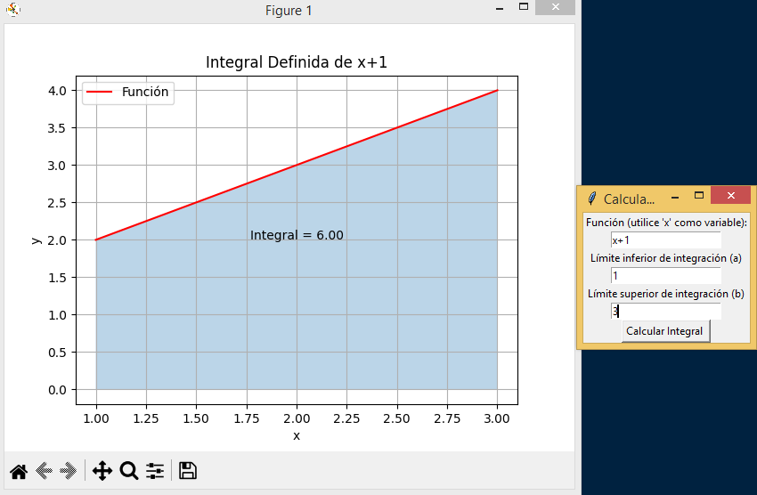
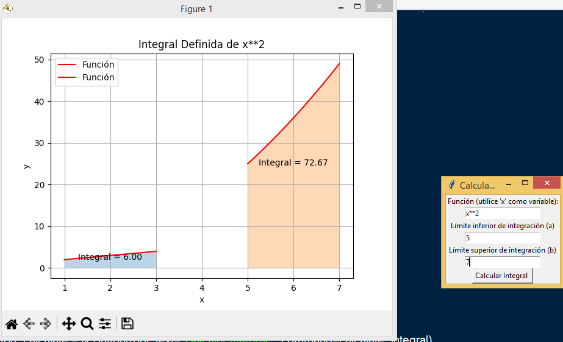

# Calculadora de Integrales

Este es un programa de Python que permite calcular y graficar la integral definida de una función dada por el usuario. Utiliza `numpy`, `matplotlib`, `scipy`, y `tkinter` para la interfaz gráfica y los cálculos matemáticos.

## Características

- Interfaz gráfica para ingresar la función y los límites de integración.
- Cálculo de la integral definida utilizando `scipy`.
- Generación de gráficos de la función y el área bajo la curva utilizando `matplotlib`.

## Requisitos

- Python 3.x
- `numpy`
- `matplotlib`
- `scipy`
- `tkinter` (normalmente incluido con la instalación estándar de Python)

Instrucciones
- Ingresar la función a integrar en el campo "Función". Usa x como la variable.
- Ingresar el límite inferior de integración en el campo "Límite inferior de integración".
- Ingresar el límite superior de integración en el campo "Límite superior de integración".
- Hacer clic en "Calcular Integral".

El programa calculará y mostrará la integral definida de la función en el intervalo especificado, y generará un gráfico de la función y el área bajo la curva.

